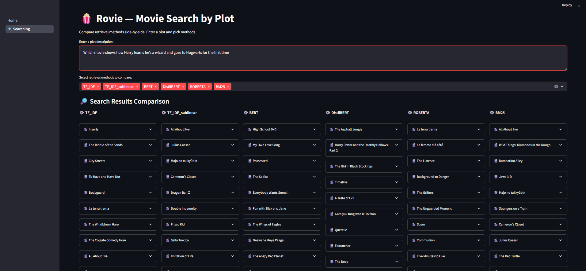

# Plot-Based-Movie-Search

## Hướng dẫn chạy

* Tải về các tập tin chỉ mục của 6 phương pháp: https://drive.google.com/drive/folders/1tnhqZ0WnBMUIZy7lwtZWV0d3yjQXIMwt?usp=drive_link và sao chép vào thư mục `Indexing` và giải nén thành cấu trúc như sau:

```
Indexing
├───bge-large-en-v1.5
│       index.faiss
│       index.pkl
│
├───bm25_1
│       bm25_index.pkl
│
├───msmarco-distilbert-base-tas-b
│       index.faiss
│       index.pkl
│
├───msmarco-roberta-base-v3
│       index.faiss
│       index.pkl
│
├───tfidf_baseline_1
│   └───tfidf_index
│       │   chunk_doc_ids.json
│       │   def_tfidf.py
│       │   meta.json
│       │   metadatas.json
│       │   texts.json
│       │   tfidf_matrix.npz
│       │   vectorizer.joblib
│       │
│       └───__pycache__
│               def_tfidf.cpython-312.pyc
│
└───tfidf_sublinearIDF_0
    └───tfidf_index
            chunk_doc_ids.json
            def_tfidf.py
            meta.json
            metadatas.json
            texts.json
            tfidf_matrix.npz
            vectorizer.joblib
```
* Cài đặt các thư viện trong `requirements.txt`
* Chạy lệnh sau: `streamlit run .\UI\Home.py`

## Đặc tả tổ chức thư mục/tập tin
* `Datasets`: Dữ liệu phim thu thập được.
* `Indexing`: Chứa mã nguồn quản lý chỉ mục cho các họ phương pháp:
    * `TF_IDF.py`: TF-IDF và TF-IDF cận tuyến tính.
    * `BERT.py`: BERT, DistilBERT, ROBERTA.
    * `BM25.py`: BM25s.
* `Evaluation`: Chứa mã nguồn giai đoạn đánh giá:
    * `evaluation.py`, `metrics`: Mã nguồn các độ đo đánh giá (P@K, R@K, AP@K, RP@K, RR@K, NDCG@K).
    * `baseline.py`: Mã nguồn thử nghiệm các độ đo đánh giá bằng thư viện `ranx`.
* `Output`: Các kết quả chạy thực nghiệm các phương pháp đánh chỉ mục.
* `UI`: Chứa mã nguồn demo.

## Giao diện tìm kiếm phim

